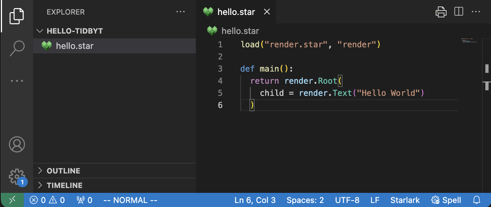

# vscode-starlark

Simple vscode extension for providing syntax highlighting for [Starlark](https://github.com/bazelbuild/starlark) in use outside of bazel (EX: developing apps in [pixlet](https://github.com/tidbyt/pixlet)).

See [vscode-bazel](https://github.com/bazelbuild/vscode-bazel/) for more language support and upstream textmate grammar definitions.
